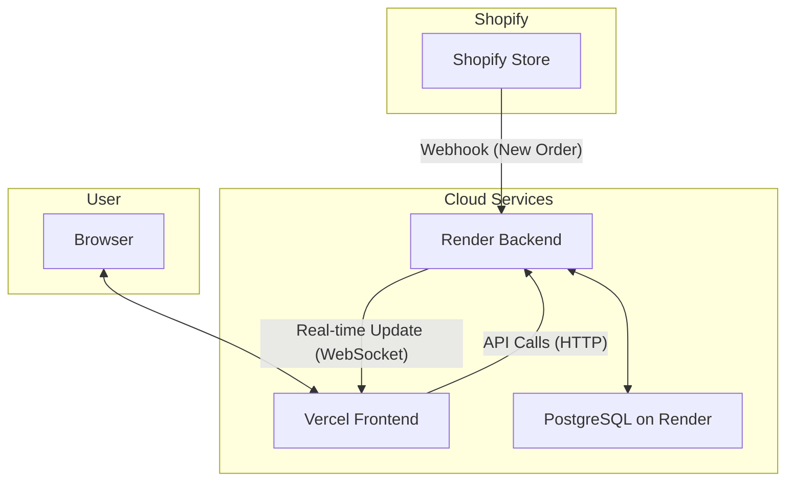

# Xeno FDE Internship Assignment: Shopify Insights Service

 This project is a multi-tenant Shopify Data Ingestion & Insights Service, built as part of the Xeno Forward Deployed Engineer (FDE) Internship assignment[cite: 1, 3].  It demonstrates a full-stack application that connects to Shopify stores, ingests key e-commerce data, and visualizes it on a real-time dashboard[cite: 6].

## 🚀 Live Demo

* **Frontend Dashboard:** `xeno-shopify-service-b7t1.vercel.app`
* **Backend Service:** `https://xeno-shopify-service-nm9i.onrender.com`

## ✨ Features

*  **Multi-Tenant Data Ingestion:** Connects to multiple Shopify stores, isolating data by a unique tenant identifier[cite: 18].
*  **Automated Data Sync:** Uses Shopify Webhooks to automatically update orders in real-time as they are created[cite: 36].
* **Manual Sync:** An API endpoint to trigger a full, idempotent sync of all products, customers, and orders.
*  **Real-time Insights Dashboard:** A clean, responsive dashboard built with Next.js and Recharts to visualize key metrics[cite: 23, 44].
*  **Key Metrics:** Displays total revenue, orders, customers, top 5 customers by spend, and a chart of revenue and orders over time[cite: 24, 25, 26].
* **Live Updates:** The dashboard updates automatically without a page reload when new orders are received, using WebSockets for real-time communication.

## 🛠️ Tech Stack

*  **Backend:** Node.js, Express.js, Prisma ORM, Socket.IO [cite: 40]
*  **Frontend:** Next.js, React, TypeScript, Tailwind CSS, Recharts [cite: 41, 44]
*  **Database:** PostgreSQL [cite: 42]
*  **Deployment:** Render (Backend & DB), Vercel (Frontend) [cite: 35]

## 🏗️ Architecture Diagram

This diagram illustrates the flow of data from Shopify to the user's browser.



## 🗄️ Database Schema

The database schema is defined using Prisma. It features a `Tenant` table to ensure data isolation between different stores.

```prisma
// prisma/schema.prisma

generator client {
  provider = "prisma-client-js"
}

datasource db {
  provider = "postgresql"
  url      = env("DATABASE_URL")
}

model Tenant {
  id                   String    @id @default(uuid())
  name                 String
  shopifyDomain        String    @unique
  shopifyAccessToken   String
  createdAt            DateTime  @default(now())

  customers Customer[]
  products  Product[]
  orders    Order[]
}

model Customer {
  id                  String   @id @default(uuid())
  shopifyCustomerId   BigInt   @unique
  email               String?
  firstName           String?
  lastName            String?
  totalSpent          Float    @default(0)
  createdAt           DateTime @default(now())

  tenantId String
  tenant   Tenant @relation(fields: [tenantId], references: [id])

  @@unique([tenantId, shopifyCustomerId])
}

model Product {
  id                 String   @id @default(uuid())
  shopifyProductId   BigInt   @unique
  title              String
  price              Float
  createdAt          DateTime @default(now())

  tenantId String
  tenant   Tenant @relation(fields: [tenantId], references: [id])

  @@unique([tenantId, shopifyProductId])
}

model Order {
  id                String   @id @default(uuid())
  shopifyOrderId    BigInt   @unique
  totalPrice        Float
  currency          String
  shopifyCreatedAt  DateTime
  createdAt         DateTime @default(now())

  tenantId String
  tenant   Tenant @relation(fields: [tenantId], references: [id])

  @@unique([tenantId, shopifyOrderId])
}
```

## 🔌 API Endpoints

* `POST /api/tenants/sync`
    * Triggers a full, one-time sync of products, customers, and orders from the Shopify store defined in the environment variables.
* `POST /api/webhooks/shopify`
    * Receives and verifies webhooks from Shopify (e.g., for `orders/create`) and upserts the data into the database.
* `GET /api/metrics/overview`
    * Returns aggregated metrics: `totalCustomers`, `totalOrders`, `totalRevenue`.
* `GET /api/metrics/orders-by-date`
    * Returns time-series data of orders and revenue grouped by date for charting.
* `GET /api/metrics/top-customers`
    * Returns the top 5 customers by their total spend.

## ⚙️ Getting Started (Local Setup)

### Prerequisites

* Node.js (v18+)
* PostgreSQL
* Git
* A Shopify Partners account and a development store

### 1. Clone the Repository

```bash
git clone https://github.com/Namanzz/xeno-shopify-service
cd xeno-shopify-service
```

### 2. Backend Setup

```bash
cd backend
npm install

# Create a .env file from the example
cp .env.example .env
```

**Fill in the `backend/.env` file with your credentials:**
* `DATABASE_URL`: Your PostgreSQL connection string.
* `SHOPIFY_STORE_DOMAIN`: e.g., `your-store.myshopify.com`
* `SHOPIFY_ADMIN_ACCESS_TOKEN`: Your Shopify Admin API access token.
* `SHOPIFY_WEBHOOK_SECRET`: Your Shopify webhook signing secret.

**Run the database migration and start the server:**

```bash
npx prisma migrate dev
npm run dev
```
The backend server will be running on `http://localhost:3001`.

### 3. Frontend Setup

```bash
cd ../frontend
npm install
npm run dev
```
The frontend development server will be running on `http://localhost:3000`.

## 📝 Assumptions & Limitations

* **Single Tenant Dashboard:** The current dashboard displays data for the first tenant found in the database (`prisma.tenant.findFirst()`).  A full production app would require user authentication to select the appropriate tenant[cite: 38].
* **Security:** Shopify tokens and secrets are stored as plain text in the database and environment variables. In a production environment, these should be encrypted at rest.
* **Webhook Scalability:** All webhooks are processed synchronously.  For high-volume stores, this process should be made asynchronous using a message queue (like RabbitMQ or Redis) to ensure reliability and performance[cite: 43].

## 🚀 Next Steps for Production

* **Implement User Authentication:** Add a full authentication system (e.g., JWT-based) to allow multiple users to sign up and securely view data for their own tenant.
* **Asynchronous Webhook Processing:** Integrate a message queue like RabbitMQ to handle webhook ingestion, making the system more resilient to spikes in traffic.
* **Encrypt Sensitive Data:** Use a service like AWS KMS or HashiCorp Vault to encrypt all sensitive credentials at rest.
* **Comprehensive Logging & Monitoring:** Integrate a logging service (like Winston or Pino) and a monitoring platform (like Datadog or Sentry) to track application health and errors.
